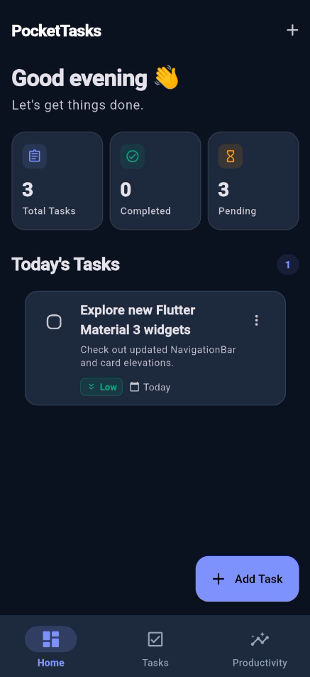
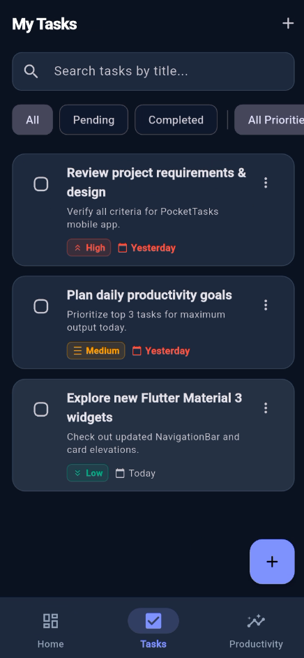
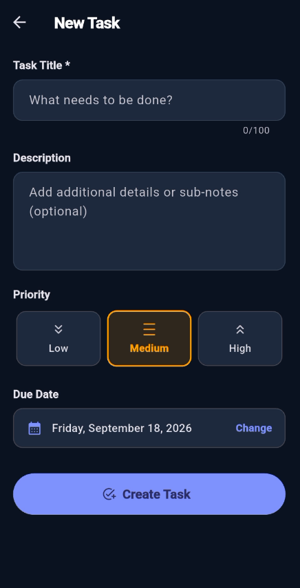
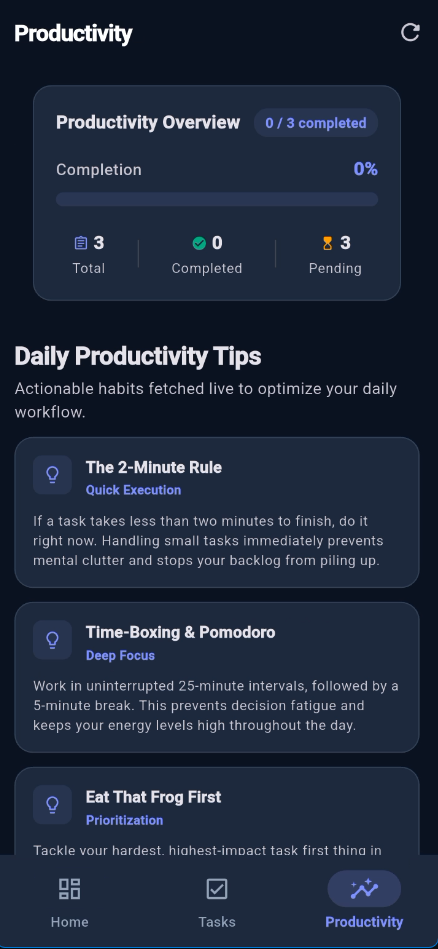

# PocketTasks — Flutter Mobile App

PocketTasks is a polished, production-style personal task and productivity management Flutter application. Users can create, organize, prioritize, search, filter, and track tasks with local persistence and live REST API productivity tips.

Designed according to modern Material 3 design principles, clean architecture, and lightweight state management suitable for an internship portfolio project.

---

## 📱 Features

- **Task CRUD Operations**: Seamlessly create, read, edit, delete, and toggle completion of tasks with deletion confirmation dialogs.
- **Dynamic Dashboard**: Personalized time-of-day greeting, real-time statistics cards (Total, Completed, Pending), and quick list of tasks due today.
- **Search & Live Filtering**:
  - Real-time search by task title and description.
  - Status filters: *All*, *Pending*, *Completed*.
  - Priority filters: *Low*, *Medium*, *High* with color-coded chips.
- **Priority Management & Due Dates**: Color-coded priority badges and native Flutter date picker with overdue task tracking.
- **Local Persistence**: Tasks persist across app restarts using `shared_preferences` with JSON serialization.
- **REST API Integration**: Demonstrates real-world API consumption using the `http` package, async/await, JSON deserialization, and loading/error/retry states.
- **Productivity Analytics**: Visual progress bar, completion ratio, percentage calculations, and live daily productivity tips.
- **Comprehensive Error Handling & Empty States**: Friendly empty states for no tasks, no search results, no completed tasks, and resilient network error retry flows.
- **Material 3 UI**: Clean, minimal, premium design with subtle borders, rounded cards (16dp radius), and full light/dark mode support.

---

## 🛠️ Tech Stack

- **Framework**: [Flutter](https://flutter.dev) (3.47+ / Material 3)
- **Language**: [Dart](https://dart.dev) (Null safety enabled)
- **State Management**: [`provider`](https://pub.dev/packages/provider) (ChangeNotifier pattern)
- **Local Storage**: [`shared_preferences`](https://pub.dev/packages/shared_preferences)
- **HTTP / REST API**: [`http`](https://pub.dev/packages/http)
- **Utilities**: [`intl`](https://pub.dev/packages/intl) (Date formatting), [`uuid`](https://pub.dev/packages/uuid) (Unique IDs)
- **Testing**: `flutter_test` (Unit & Widget testing)

---

## 🏗️ Architecture

PocketTasks follows a clean, modular architecture separating UI presentation from state management and persistence:

```text
lib/
├── models/                     # Data models & serialization logic
│   ├── task.dart
│   ├── task_priority.dart
│   └── productivity_tip.dart
│
├── services/                   # Low-level I/O services (Storage & REST API)
│   ├── task_storage_service.dart
│   └── api_service.dart
│
├── repositories/               # Coordinates data operations between state and services
│   └── task_repository.dart
│
├── providers/                  # Application state, search/filter algorithms, and statistics
│   └── task_provider.dart
│
├── screens/                    # UI screens & navigation shell
│   ├── main_navigation_screen.dart
│   ├── home_screen.dart
│   ├── tasks_screen.dart
│   ├── productivity_screen.dart
│   └── task_form_screen.dart
│
├── widgets/                    # Reusable, small presentation widgets
│   ├── task_card.dart
│   ├── statistic_card.dart
│   ├── priority_badge.dart
│   └── empty_state.dart
│
├── theme/                      # Material 3 light and dark theme definitions
│   └── app_theme.dart
│
└── main.dart                   # Application entry point & MultiProvider wiring
```

### Data Flow

```text
UI (Widgets / Screens)
        ↓  Dispatches user events (add, edit, search, filter)
State / Controller (TaskProvider)
        ↓  Business logic & calculations
Repository (TaskRepository)
        ↓  Abstracts data sources
Services (TaskStorageService / ApiService)
        ↓
Local Storage (SharedPreferences) / Public REST API (JSONPlaceholder)
```

---

## 🧪 Testing

PocketTasks includes unit and widget test coverage:

- **Model Tests**: Task model creation, `isDueToday`, `isOverdue`, `copyWith`, and JSON serialization.
- **Provider Tests**: Dynamic completion metrics, status filtering, priority filtering, live search queries, and task CRUD mutations.
- **Widget Tests**: Dashboard rendering, tab navigation, dynamic statistic counters, and form validation (required title check).

Run tests with:

```bash
flutter test
```

---

## 🤖 AI-Assisted Development

This project was developed using AI-assisted pair programming:
- **Boilerplate & Models**: Generating immutable Dart models and JSON converters.
- **UI Implementation**: Rapid prototyping of Material 3 widgets, responsive layouts, and animations.
- **Debugging & Refactoring**: Resolving analyzer lints, compiler errors, and optimizing state notifications.
- **Test Generation**: Generating comprehensive unit tests and widget tests with mock repositories.
- **Documentation**: Structuring clean architecture documentation and README.

*All generated code was reviewed, validated, and verified against Flutter static analysis and automated test suites.*

---

## 📸 Screenshots

| Home / Dashboard | Tasks Screen | Add / Edit Task | Productivity Screen |
| :---: | :---: | :---: | :---: |
|  |  |  |  |

---

## 🔮 Future Improvements

- **Firebase Authentication**: User accounts and secure multi-device profiles.
- **Cloud Synchronization**: Cloud Firestore sync for access across mobile, web, and desktop.
- **Push Notifications**: Local reminders for upcoming and overdue tasks.
- **Recurring Tasks**: Daily, weekly, and monthly repeating task schedules.
- **iOS & Desktop Deployment**: Optimized layout enhancements for larger tablets and desktop windows.

---

## 🚀 Getting Started

### Prerequisites
- Flutter SDK `^3.13.2` or later
- Dart SDK `^3.13.2` or later

### Installation
1. Clone or navigate to the repository directory:
   ```bash
   cd "pocket tasks"
   ```
2. Install dependencies:
   ```bash
   flutter pub get
   ```
3. Run the application:
   ```bash
   flutter run
   ```

---

## 👨‍💻 Author

**Ahmad bin Haq Nawaz**
- 📱 Junior Flutter & Mobile App Developer
- 📧 Email: [ahmadbinhaqnawaz@gmail.com](mailto:ahmadbinhaqnawaz@gmail.com)
- 🐙 GitHub: [@Ahmad-Codemaster](https://github.com/Ahmad-Codemaster)
- 📍 Faisalabad, Pakistan
